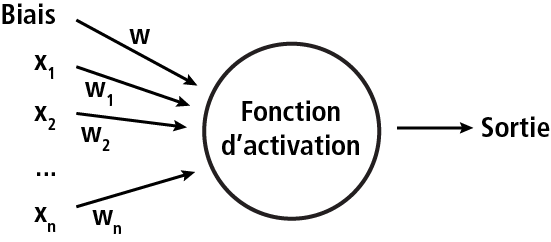
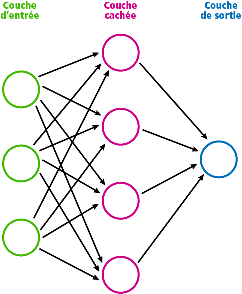

# Réseaux de neurones pour la régression

Les réseaux de neurones sont issus de l'intelligence artificielle. Plus correctement, c'est une méthode d'apprentissage statistique. Il s'agit d'un modèle statistique, tout comme une régression multiple ou encore une régression logistique. La différence avec un modèle de régression est qu'un réseau de neurones peut tenir compte de relations non-linéaires. En fait, une régression multiple peut être considérée comme un étant un cas particulier de réseau de neurones.

Les réseaux de neurones tentent d'imiter le modèle d'apprentissage des réseaux neuronaux biologiques, tel que notre cerveau. Dans un réseau de neurones biologique, les neurones sont connectés entre eux avec des dendrites qui reçoivent des entrées et sur la base de ces entrées produisent un signal de sortie qui va être dirigé vers un autre neurone. Nous essayons d'imiter ce processus avec les réseaux de neurones artificiels (Artificial Neural Network ou ANN).

La forme la plus basique d'un ANN est le perceptron qui prend une série de valeurs en entrée et qui donne une seule valeur en sortie:

Les valeurs d'entrée sont multipliées avec des poids et une constante ajoutée, avant de faire la somme (comme dans une régression multiple). Ensuite, une fonction d'activation transforme cette valeur en la valeur de sortie. Cette fonction d'activation peut être dans le cas le plus simple une fonction linéaire, mais d'autres fonctions sont également possibles et courantes.

Ensuite, les différents perceptrons sont combinés en couches. Voici un exemple:

Si notre réseau de neurones est un modèle de régression avec 3 variables en entrée (les variables indépendantes x), et 1 variable en sortie (la variable dépendante y), nous avons un perceptron pour chaque variable d'entrée dans une première couche (la couche d'entrée). Nous avons un seul perceptron dans la couche de sortie qui représente notre prédiction. Entre deux, nous avons des *couches cachées* de taille variables. Le nombre de couches cachées peut varier. Une seule couche nous donnera un modèle linéaire, et avec plus d'une couche, un modèle non-linéaire devient possible. La définition de nombre de couches cachées et le nombre de perceptrons par couches repose en grande partie sur l'expérience personnelle. Il est une bonne idée d'essayer plusieurs tailles avant d'arriver à un résultat optimal.

Un réseau de neurones doit être entrainé. Ceci veut simplement dire que le réseau va essayer de trouver les poids optimal pour chaque connection entre les neurones dans le but de minimiser l'erreur, donc pour avoir une bonne prédiction.

Pour voir comment créer un réseau de neurones avec R, consultez le notebook [60-ann](60-ann.ipynb).
